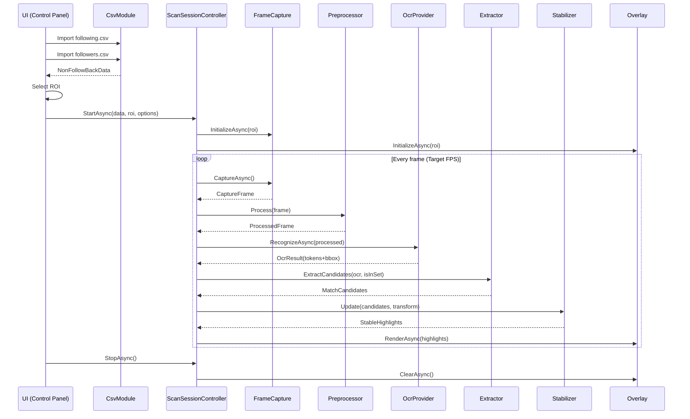

# GUI Unfollowed (OCR) — Architecture & Happy Path Flow

## 1) Dependency graph (logical level)

- **GuiUnfollowed.App**
  - depends on: Core, Csv, Capture, Preprocess, Ocr, Overlay
- **GuiUnfollowed.Core**
  - depends on: nothing (BCL only)
- **GuiUnfollowed.Csv**
  - depends on: Core
- **GuiUnfollowed.Capture**
  - depends on: Core (for models), optionally Windows APIs
- **GuiUnfollowed.Preprocess**
  - depends on: Capture, Core
- **GuiUnfollowed.Ocr**
  - depends on: Preprocess, Core
- **GuiUnfollowed.Overlay**
  - depends on: Core, Capture

**Principle:** the OCR provider and overlay renderer are “plugin-like” (via interfaces) to allow swapping them without rippling changes across the rest of the application.

---

## 2) Happy path (run-time) — step-by-step description

### 2.1 Setup data (CSV)
1) User uploads `following.csv`  
2) `ICsvImporter.ImportUsernames()` → `CsvImportResult following`  
3) User uploads `followers.csv`  
4) `ICsvImporter.ImportUsernames()` → `CsvImportResult followers`  
5) `INonFollowBackCalculator.Compute(following, followers)` → `NonFollowBackData`  
6) UI displays totals + `NonFollowBack count`

### 2.2 Setup ROI
7) User clicks “Select ROI”  
8) `IRoiSelector.SelectRegionAsync()` → `RoiSelection`  
9) UI shows a preview (optional) + “Start” button

### 2.3 Scanning loop
10) `IScanSessionController.StartAsync(data, roi, options)`  
11) Internally:
   - `IFrameCapture.InitializeAsync(roi)`
   - `IOverlayRenderer.InitializeAsync(roi)`
   - `IHighlightStabilizer.Reset()`

12) Loop (until Stop):
   - Capture:
     - `frame = await capture.CaptureAsync(ct)`
   - Preprocess:
     - `processed = preprocessor.Process(frame, options.Preprocess)`
   - OCR:
     - `ocr = await ocrProvider.RecognizeAsync(processed, options.Ocr, ct)`
   - Extract + Match:
     - `candidates = extractor.ExtractCandidates(ocr, options.Extraction, isInSet)`
   - Stabilize + map ROI → Screen:
     - `transform = new RoiToScreenTransform(...)`
     - `highlights = stabilizer.Update(candidates, transform, options.Stabilizer)`
   - Render overlay:
     - `await overlay.RenderAsync(highlights, ct)`
   - Frame pacing:
     - sleep/delay to respect Target FPS

13) Stop:
   - `overlay.ClearAsync()`
   - dispose capture/overlay
   - reset UI state

---

## 3) Sequence diagram (Mermaid)

---

## 4) Frame pacing / scheduling (deterministic)

**MVP recommendation:**
- `TargetFps = 4` (250 ms frame budget)
- if OCR takes longer than the budget:
  - don’t “accelerate” (don’t try to compensate with negative delay); just process as much as you can
  - log WARN “Frame over budget”

Pseudo:
- `startTick = now`
- process pipeline
- `elapsed = now - startTick`
- `delay = max(0, frameBudget - elapsed)`
- `await Task.Delay(delay)`

---

## 5) Error handling (pragmatic MVP)

### 5.1 CSV
- column not detected: UI asks for manual selection
- invalid rows: continue, log + stats

### 5.2 Capture
- invalid ROI: refuse start
- capture fails (e.g., permissions/another app): stop session + clear message

### 5.3 OCR
- OCR exception: retry limit 1/frame; if it persists, stop session and log ERROR

### 5.4 Overlay
- overlay init fails: stop session and suggest “run as admin” only if necessary (not by default)

---

## 6) Work items (task breakdown for incremental implementation)

### Milestone M0 — Repo & skeleton
- [ ] Create solution structure (App/Core/Csv/Capture/Preprocess/Ocr/Overlay/Tests)
- [ ] Add DI container + logging abstraction
- [ ] Add docs (PRD/TDD/INTERFACES/ARCHITECTURE)

### Milestone M1 — CSV core
- [ ] Implement `IUsernameNormalizer` + tests
- [ ] Implement `ICsvImporter` (auto-detect column) + tests
- [ ] Implement `INonFollowBackCalculator` + tests
- [ ] UI: Import following/followers + show stats

### Milestone M2 — ROI selection + Overlay stub
- [ ] Implement `IRoiSelector` (region selection)
- [ ] Implement `IOverlayRenderer` stub: draws ROI border only (no OCR)
- [ ] Calibration: confirm overlay alignment

### Milestone M3 — Capture + OCR baseline
- [ ] Implement `IFrameCapture` (ROI capture) — basic working
- [ ] Implement `IFramePreprocessor` (minimal grayscale)
- [ ] Implement `IOcrProvider` (Windows OCR or initial provider)
- [ ] UI: Start/Stop pipeline, show OCR text debug (optional)

### Milestone M4 — Extract + Match + Highlight
- [ ] Implement `IUsernameExtractor` (regex + cleanup + stopwords)
- [ ] Implement `IHighlightStabilizer` (K out of M)
- [ ] Map ROI → Screen coords
- [ ] Render highlights in overlay (rect + badge)

### Milestone M5 — Quality & performance
- [ ] Preprocess profiles Light/Dark
- [ ] Confidence threshold UI control
- [ ] FPS control + pacing
- [ ] Basic frame-diff gating (optional v1)

### Milestone M6 — Packaging
- [ ] Installer or single-file publish
- [ ] App settings persistence
- [ ] Logs folder + “clear session data”

---

## 7) Definition of Done (for milestone “Highlight works”)
- CSV import produces correct NonFollowBack output
- ROI selection + overlay calibration work
- OCR + extraction detect usernames in ROI with sufficient consistency
- Highlight appears over NonFollowBack accounts; overlay remains click-through
- Stabilization reduces flicker to an acceptable level (K=2/M=3)
- Logs include per-frame processing times and clear errors
